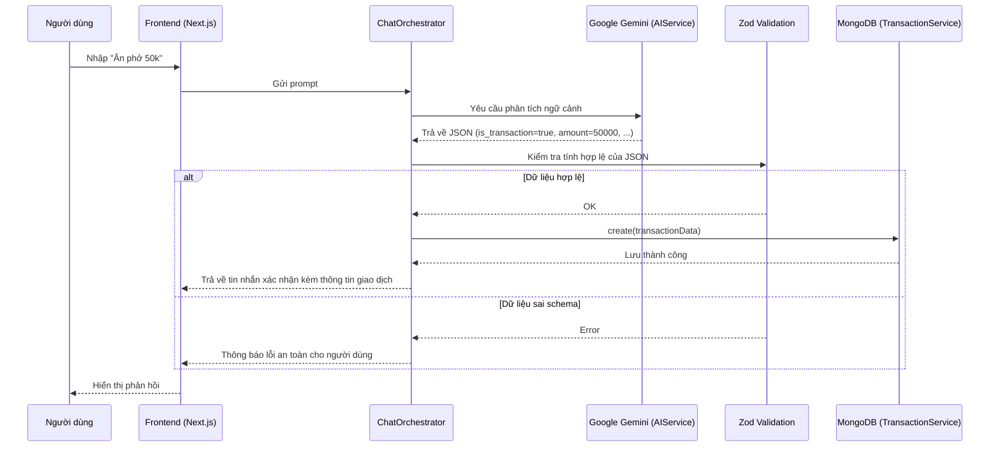

# My Wallet - AI Orchestrator

Dự án nghiên cứu khả năng của **AI** trong vai trò bộ não điều phối logic nghiệp vụ (Orchestrator) thay thế cho các luồng xử lý code truyền thống trong quản lý tài chính cá nhân.

---

## Mục lục
- [Giới thiệu](#giới thiệu)
- [Kiến trúc AI Orchestrator](#kiến-trúc-ai-orchestrator)
- [Quy trình xử lý dữ liệu](#quy-trình-xử-lý-dữ-liệu)
- [Tính năng chính](#tính-năng-chính)
- [Công nghệ sử dụng](#công-nghệ-sử-dụng)
- [Cấu trúc thư mục](#cấu-trúc-thư-mục)
- [Hướng dẫn cài đặt](#hướng-dẫn-cài-đặt)
- [Biến môi trường](#biến-môi-trường)
- [Triết lý thiết kế UI UX](#triết-lý-thiết-kế-ui-ux)

---

## Giới thiệu
Dự án tập trung vào việc sử dụng **LLM (Large Language Model)** không chỉ để trả lời văn bản mà còn để ra quyết định và thực thi các nghiệp vụ phần mềm. Thay vì viết hàng trăm dòng logic `if-else` phức tạp để phân loại giao dịch hoặc hiểu ý định người dùng, hệ thống sử dụng một lớp **Orchestrator** để cầu nối giữa ngôn ngữ tự nhiên và database.

## Kiến trúc AI Orchestrator
Hệ thống được xây dựng dựa trên các tiêu chuẩn thiết kế cấp Enterprise nhằm đảm bảo tính ổn định và khả năng mở rộng:

1. **Orchestrator Pattern**: Sử dụng `ChatOrchestrator` để điều phối toàn bộ luồng xử lý. Nó nhận kết quả phân tích từ AI, sau đó quyết định xem nên lưu giao dịch vào DB hay chỉ trả lời tin nhắn thông thường.
2. **Dependency Injection**: Áp dụng DI cho các Service, giúp mã nguồn tách biệt (Decoupled) và dễ dàng viết Unit Test.
3. **Data Boundary Safety**: Toàn bộ dữ liệu sinh ra bởi AI được xác thực thông qua **Zod Runtime Validation**. Điều này giúp hệ thống miễn nhiễm với hiện tượng "ảo giác" (Hallucination) của AI — nếu AI trả về dữ liệu sai cấu trúc, hệ thống sẽ chặn đứng và xử lý lỗi an toàn thay vì crash.
4. **Prompt Engineering**: Hệ thống System Prompt được tách biệt hoàn toàn khỏi logic code, cho phép tinh chỉnh prompt mà không cần can thiệp vào Core Logic.

## Quy trình xử lý dữ liệu
Dưới đây là sơ đồ trình tự thể hiện cách một yêu cầu từ người dùng được xử lý thông qua hệ thống AI:



## Tính năng chính
- **AI Classification**: Tự động nhận diện danh mục (Ăn uống, Di chuyển, Lương...) từ dữ liệu thô người dùng nhập vào.
- **Natural Language Interaction**: Quản lý tài chính thông qua giao diện chat tự nhiên.
- **Robust Exception Handling**: Phát hiện và xử lý lỗi cấu trúc JSON từ AI một cách thông minh.
- **Real-time Processing**: Xử lý và cập nhật trạng thái ví ngay lập tức.

## Công nghệ sử dụng
- **Frontend/Backend**: Next.js 15 (App Router), React 19, TypeScript.
- **Styling**: TailwindCSS 4, Lucide React (Icons), SweetAlert2.
- **AI Engine**: Google Generative AI (@google/genai).
- **Database**: Mongoose (MongoDB).
- **Validation**: Zod (Runtime Type Check).
- **Runtime**: Node.js v20+, pnpm.

## Cấu trúc thư mục
```bash
src/
├── app/               # Next.js App Router (Pages & API Routes)
├── components/        # UI Components (ChatInterface, TransactionTable, v.v.)
├── context/           # React Context (Quản lý State tập trung)
├── hooks/             # Custom Hooks (useTransactions, useChat, v.v.)
├── lib/
│   ├── services/      # Business Logic (Orchestrator, AIService, API Services)
│   ├── repositories/  # Data Access Layer (Kết nối Database)
│   ├── models/        # Mongoose Schemas & TypeScript Types
│   ├── context/       # AI Prompts & Validation Schemas
│   └── utils/         # Helper functions
└── app.config.ts      # Cấu hình hệ thống tập trung
```

## Hướng dẫn cài đặt
Để chạy dự án ở môi trường local, hãy thực hiện theo các bước sau:

1. **Clone repository**
   ```bash
   git clone https://github.com/maithehao/my-wallet.git
   cd my-wallet
   ```

2. **Cài đặt dependencies**
   Sử dụng `pnpm` (khuyến nghị):
   ```bash
   pnpm install
   ```

3. **Cấu hình biến môi trường**
   Sao chép file `.env.example` thành `.env` và điền đủ thông tin:
   ```bash
   cp .env.example .env
   ```

4. **Chạy ứng dụng**
   ```bash
   pnpm dev
   ```
   Ứng dụng sẽ chạy tại: [http://localhost:3000](http://localhost:3000)

## Biến môi trường
Cần cấu hình các biến sau trong file `.env`:

- `GOOGLE_AI_STUDIO_API_KEY`: API Key lấy từ [Google AI Studio](https://ai.google.dev/).
- `MONGODB_URI`: Đường dẫn kết nối tới MongoDB.
- `NEXT_PUBLIC_API_BASE_URL`: URL cơ sở của API (mặc định cho local là http://localhost:3000).

## Triết lý thiết kế UI UX
Dự án theo đuổi phong cách thiết kế **Premium & Modern**:
- **Dark Mode First**: Giao diện tối sang trọng, giảm mỏi mắt.
- **Glassmorphism**: Hiệu ứng lớp mờ hiện đại.
- **Micro-animations**: Các tương tác nhỏ mượt mà từ Framer Motion và CSS Transitions.
- **Mobile Responsive**: Hiển thị hoàn hảo trên mọi kích thước màn hình.

---
Built by **C4F**
