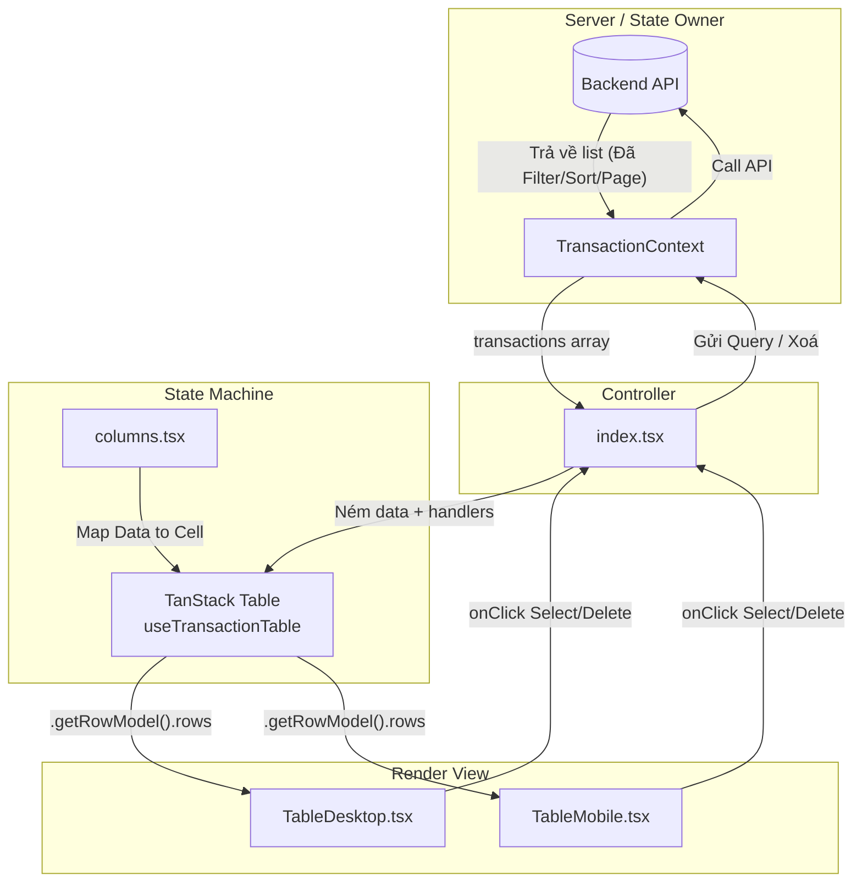

# Transaction Table Component

Group Component này được xây dựng theo kiến trúc **Mẫu thiết kế tách bạch Logic và Chuẩn trình bày (Separation of Concerns)** kết hợp với triết lý **Single Source of Truth** từ Server.

## 1. Cấu trúc Component

Mục tiêu của cấu trúc này là để đảm bảo khả năng tối ưu hóa với các trình AI và dễ dàng bảo trì. Việc phân tầng giúp UI Component hoàn toàn trở nên "ngốc" (Dumb component) và chỉ tập trung vào việc hiển thị theo ý định.

```tree
src/components/TransactionTable/
├── index.tsx                  # Controller (Entry point)
├── useTransactionTable.ts     # Engine/Hook bọc lõi của TanStack Table
├── columns.tsx                # Tập trung toàn bộ Cấu hình Cột & Định dạng của Table (Rich Aesthetics)
├── table-types.ts             # Type Definitions Strict
├── utils.ts                   # Các hàm helper nội bộ (VD: formatAmount)
└── ui/                        # Tầng View (Render Layer)
    ├── TableDesktop.tsx       # Giao diện table truyền thống (flexRender)
    ├── TableMobile.tsx        # Giao diện thẻ Card cho Mobile (row.original)
    └── TablePagination.tsx    # Giao diện điều hướng
```

## 2. Luồng Dữ liệu (Data Flow Diagram)

Kiến trúc này tránh hoàn toàn tình trạng **"Double Source of Truth"**. Thay vì để TanStack tự nhào nặn Sorting và Filtering ở Client (điều dẫn đến sự bất đồng bộ), TanStack chỉ được hoạt động như một **View Layer Engine** (`manualSorting: true`, `manualFiltering: true`).



## 3. Quy ước mở rộng (AI/Dev Friendly)

- **Cần thêm Một cột mới?** Tuyệt đối không chạm vào `TableDesktop.tsx`. Mở `columns.tsx` và thêm 1 object con vào array `columns`. Mọi thứ sẽ tự động Render.
- **Cần sửa Header Class?** Sử dụng `meta: { headerClassName: '...' }` định nghĩa trong `columns.tsx`.
- **Thêm Cảnh báo lúc Xoá?** Xử lý luồng Swal ở cấp cao nhất `index.tsx`, không tự định nghĩa handle ở trong các file UI con.

> **Note:** Hệ thống phân trang, sắp xếp và lọc hiện tại được quản lý *Trực tiếp* từ Server/Context. Bất kì thao tác nào thay đổi lưới dữ liệu trên màn hình đều phải trigger hàm `fetchTransactions()` của Context.
